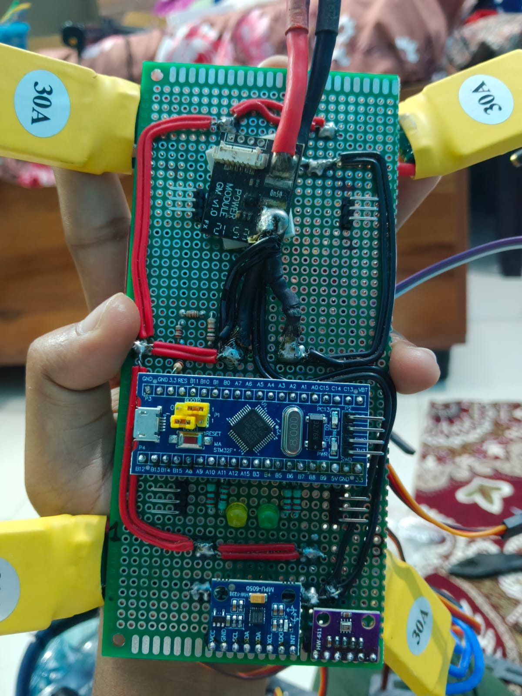
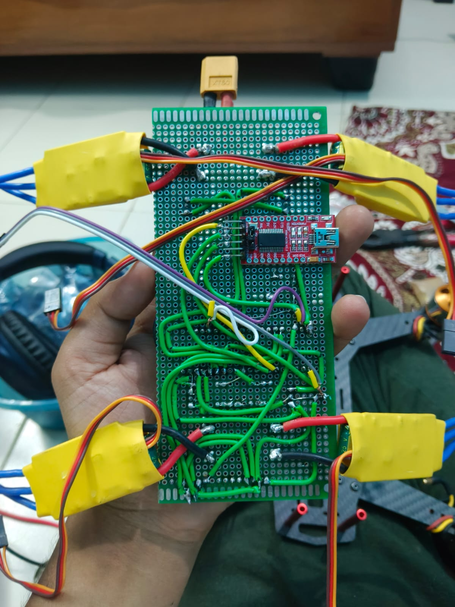
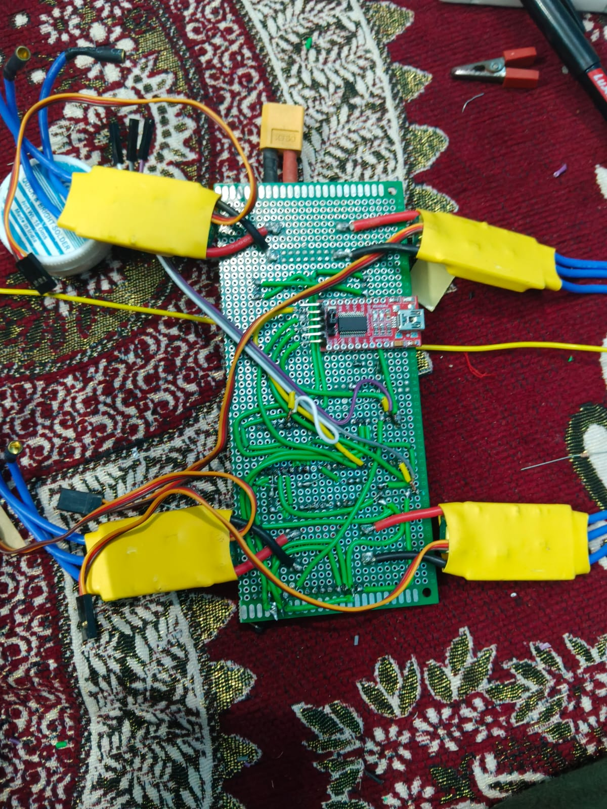
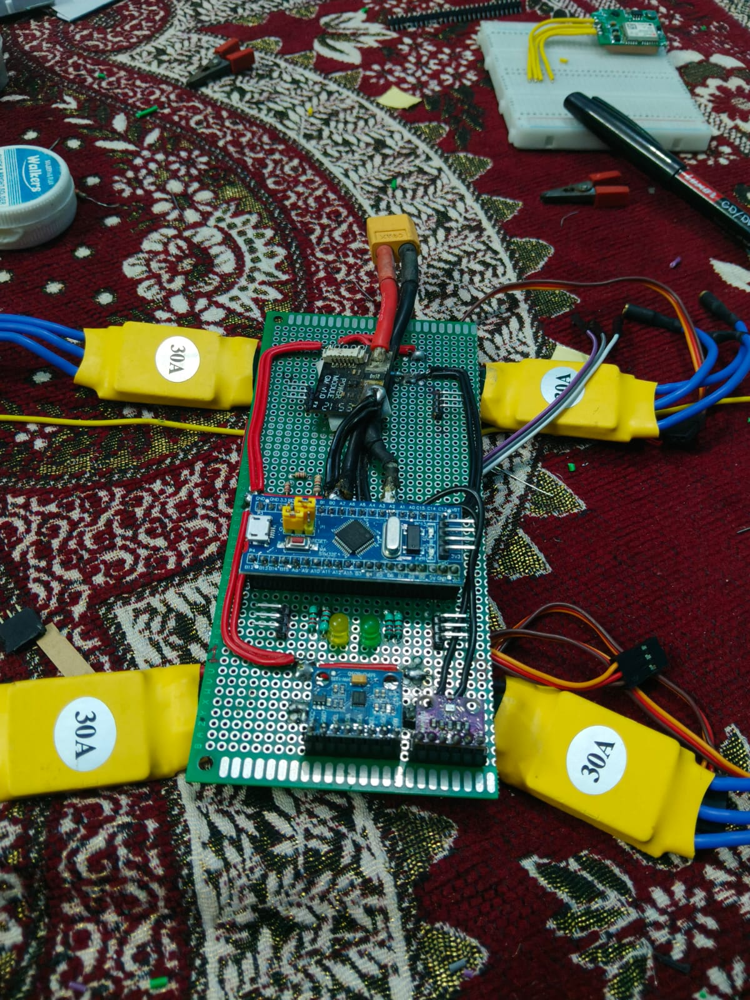

<p align="center">
  <h1 align="center">🦅 HawkPilot32</h1>
  <p align="center">
    <strong>Custom 32-Bit STM32F103C8T6 Flight Controller Firmware with GPS, Altitude Hold & Telemetry</strong>
  </p>
  <p align="center">
    6-Axis PID Stabilization · Altitude Hold · Course Lock · GPS Waypoint Lock · Live Telemetry
  </p>
</p>

---

## 🔍 Overview

**HawkPilot32** is a custom, highly responsive 32-bit flight controller firmware designed specifically for the **STM32F103C8T6 (Blue Pill)** microcontroller. Serving as the custom flight controller companion firmware for the **HaWkEye** drone surveillance system, this firmware features full 6-axis stabilization, barometric altitude hold, magnetometer-guided heading lock, GPS position hold, and custom bitbanged telemetry for real-time monitoring.

This codebase is a modified fork of **Joop Brokking's** renowned open-source **YMFC-32 Auto** flight controller. It has been customized to include optimized PID tuning for responsive 500-700g quadcopter frames, reliable multi-rate GPS parsing, battery compensation, and robust peripheral communication interfaces.

---

## ✨ Key Features

| Feature | Description |
|---------|-------------|
| **6-Axis PID Control** | Smooth gyro and accelerometer stabilization utilizing the MPU-6050 over I2C |
| **Barometric Alt-Hold** | Precision vertical control via BMP280 pressure sensing and a custom complementary filter |
| **Heading Course Lock** | Compass-guided direction control using tilt-compensated HMC5883L magnetometer data |
| **GPS Position Hold** | Waypoint-locking NMEA parser utilizing ublox 5Hz updates, dead-band, and D-term velocity damping |
| **Live Telemetry Output**| Real-time software bitbanged telemetry (9600 bps, 8N1) on pin PB0 transmitting flight parameters |
| **Fail-Safe Monitoring** | Low-voltage detection, sensor diagnostic locks, and active watchdog safety triggers |

---

## 🏗️ Codebase Architecture

```
HawkPilot32/
├── HawkPilot32.ino                   # Main entry point (Setup, 250Hz Control Loop, Task Scheduling)
├── HawkPilot32_Barometer.ino         # BMP280 initialization, calibration, and pressure calculations
├── HawkPilot32_LED_control.ino       # LED blink sequences for flight modes and GPS sat count indicator
├── HawkPilot32_PID.ino               # Main PID loops for Roll, Pitch, Yaw, and Altitude holds
├── HawkPilot32_Calibration.ino       # Level, Gyro offset, and 3D compass calibration routines
├── HawkPilot32_Settings.ino          # In-flight parameter tuning via RC receiver stick commands
├── HawkPilot32_Gyro.ino              # MPU-6050 configuration, data read, and register setups
├── HawkPilot32_InputCapture.ino      # Timer 2 ISR decoding 6-Channel PPM RC receiver signals
├── HawkPilot32_Compass.ino           # Magnetometer setup, tilt-compensation, and course calculations
├── HawkPilot32_GPS.ino               # Comma-delimited NMEA (GGA, GSA) parser and waypoint navigation
├── HawkPilot32_Telemetry.ino         # Telemetry frame composition and bitbanged serial transmission
├── HawkPilot32_Sequence.ino          # Auto-takeoff detection, arming, disarming, and status loops
├── HawkPilot32_Timer.ino             # Hardware Timer 4 setup generating 250Hz PWM signals for ESCs
└── HawkPilot32_Altitude.ino          # Vertical acceleration calculations and accelerometer integration
```

```
HawkPilot32_GPS_Diagnostic/
└── HawkPilot32_GPS_Diagnostic.ino    # Standalone baud-scanner and diagnostic utility for GPS setup
```

---

## 📌 STM32 Blue Pill Pin Map

The flight controller maps the following I/O pins on the STM32F103C8T6 microcontroller:

| Pin | Function / Target | Type | Description |
|---|---|---|---|
| **PA0** | RC Receiver (PPM) | Input | Timer 2 Channel 1 input capture interrupt pin |
| **PA2** | GPS Module RX | Output | USART2 TX connected to GPS RX |
| **PA3** | GPS Module TX | Input | USART2 RX connected to GPS TX |
| **PA4** | Battery Voltage Monitor| Analog Input | Read through 10k:1k resistor voltage divider |
| **PB0** | Telemetry TX | Output | Bitbanged serial output (9600 baud, 8N1) |
| **PB3** | Green Status LED | Output | Displays flight modes |
| **PB4** | Red Error LED | Output | Displays boot diagnostics, errors, and low-voltage alarms |
| **PB6** | ESC 1 Control Signal | PWM Output | Timer 4 Channel 1 output (Front-Right CCW Motor) |
| **PB7** | ESC 2 Control Signal | PWM Output | Timer 4 Channel 2 output (Rear-Right CW Motor) |
| **PB8** | ESC 3 Control Signal | PWM Output | Timer 4 Channel 3 output (Rear-Left CCW Motor) |
| **PB9** | ESC 4 Control Signal | PWM Output | Timer 4 Channel 4 output (Front-Left CW Motor) |
| **PB10**| I2C2 SCL (Clock) | I/O | Shares clock line for Gyro, Magnetometer, and Barometer |
| **PB11**| I2C2 SDA (Data) | I/O | Shares data line for Gyro, Magnetometer, and Barometer |
| **PC13**| Onboard Blue Pill LED | Output | Inverted state output for GPS lock status display |

---

## 🛠️ Hardware Requirements

### Used Hardware
* **Microcontroller (MCU):** STM32F103C8T6 (Blue Pill) - 32-bit ARM Cortex-M3 processor (72MHz) providing high-performance 32-bit execution.
* **IMU (Gyro + Accelerometer):** MPU-6050 6-DOF sensor over I2C2.
* **Magnetometer (Compass):** HMC5883L 3-axis digital compass (for tilt-compensated course heading lock).
* **Barometer (Altimeter):** BMP280 barometric pressure sensor (for altitude hold control).
* **GPS Receiver:** ublox BN-880 (with integrated compass) or M8N module (configured for 5Hz NMEA output on USART2).
* **Telemetry Link:** 915MHz 3DR Radio Telemetry Transceiver (transmitting live logs at 9600 bps via PB0 bitbang).
* **Radio Control Receiver:** 6-Channel PPM RC Receiver (connected to pin PA0 for input capture decoding).
* **Power Distribution & ESCs:** 30A Brushless ESCs (with 5V BEC regulator) powering 2200KV brushless motors.
* **Power Supply:** 3S (11.1V) LiPo battery pack monitored through a 10k:1k resistor voltage divider network on PA4.

### Supportive Hardware
* **Alternative Pressure Sensors:** MS5611, BMP180 barometric sensors.
* **Alternative Telemetry Modules:** HC-12 433MHz RF wireless modules or Bluetooth transceivers (for short-range configuration and testing).
* **Standard GPS Modules:** Any standard NMEA-0183 compliant GPS module supporting automatic baud scanning (from 4800 to 115200 bps via the built-in diagnostic utility).
* **RC Receivers:** Standard PWM receivers (requires an external PWM-to-PPM encoder module).
* **Alternative Battery Monitoring:** 2S to 4S LiPo configurations (by adjusting the voltage divider scaling variables in the firmware settings).

---

## 📸 Hardware Setup & Circuit Images

Below are the hardware wiring circuit schematics and physical assembly photos:

### Circuit Schematic Diagram


### Assembly & Wiring Photos
<p align="center">
  
  
</p>
<p align="center">
  
  
</p>

---

## 🚀 Getting Started & Flashing

### Prerequisites
1. **Arduino IDE 1.8.x+** or **Arduino IDE 2.x** installed.
2. **STM32 Cores by STM32duino** installed via the Board Manager:
   - Go to `File -> Preferences -> Additional Board Manager URLs`.
   - Add: `https://github.com/stm32duino/BoardManagerFiles/raw/main/package_stmicroelectronics_index.json`.
   - Open `Tools -> Board -> Board Manager`, search for `STM32 Cores` and install it.
3. An **ST-Link V2 programmer** or **USB-TTL serial converter** to upload the compiled firmware.

### Board Configuration settings:
Inside Arduino IDE under the `Tools` menu:
- **Board:** "Generic STM32F1 series"
- **Board part number:** "BluePill F103C8"
- **Uploader method:** "STLink" or "Serial" (depending on programmer used)
- **Optimize:** "Smallest (-Os) (default)"

### Compilation & Flash
1. Rename your workspace directory to `HawkPilot32` (completed).
2. Open the main program file `HawkPilot32.ino` in Arduino IDE.
3. Click **Verify** to compile. Ensure there are no compilation warnings.
4. Connect the ST-Link V2 to the Blue Pill programming header (GND, CLK, DIO, 3.3V).
5. Click **Upload** to flash the firmware.

---

## 🙏 Credits & Acknowledgements

We want to express our sincere appreciation and gratitude to **Joop Brokking** for creating and open-sourcing the **YMFC-32 Auto** flight controller. His incredible step-by-step video guides and clean, educational source code have provided the foundation for this customized flight controller. Without his efforts in teaching and open-sourcing, this project would not be possible.

For details on his original project:
* **Creator:** Joop Brokking
* **Website:** [Brokking.net](http://www.brokking.net/)
* **YouTube Channel:** [Brokking on YouTube](https://www.youtube.com/user/brokking)
* **Original Project:** YMFC-32 Auto (Your Multi-Copter 32-bit Auto Flight Controller)
